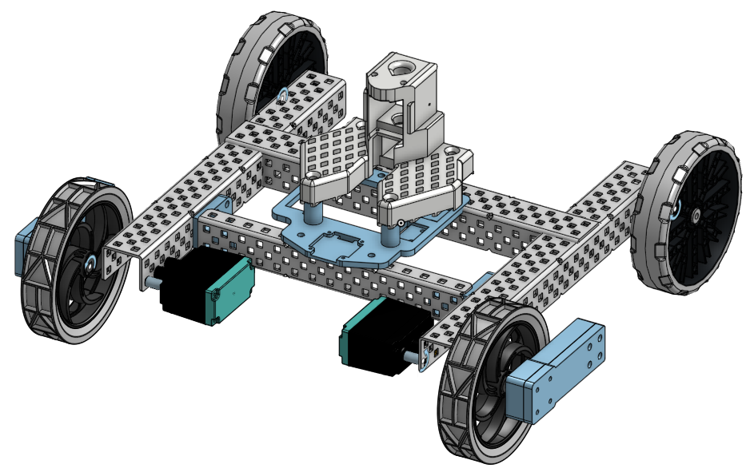

# SOBle - SO101 Platform Control Package over Bluetooth



The So101 Platform is a simple chassis with two wheels for differential drive and a couple of sensors to help with several different autonomous algorithms. These sensors include

- a magnetic encoder (12-bit) on each of the left and right wheels
- a 6-axis inertial measurement unit for heading, pitch, and roll
- an optional apriltag detector mounted on the top of the gripper

In particular, this python package provides the code host-side control and teleop of the SO101 platform over BLE, plus USB **leader** arm mapping. It also includes several 3D models for printing as well as a list of sourced parts, in case you wish to build the platform yourself.

---

## Install

```bash
pip install "soble @ git+https://github.com/timrobot/SOBle.git@master"
```

---

## Quick usage

First, plug in the leader arm into your laptop. Make sure to record the port for your leader, as you will need it during connection.

```python
from soble import SO101Leader, SO101Platform

config = {
    "leader": {
        "J1": [675, 3270],
        "J2": [1801, 350],
        "J3": [553, 2544],
        "J4": [105, 2408],
        "J5": [2330, 6144],
        "J6": [2046, 3261],
    },
    "follower": {
        "J1": [671, 3387],
        "J2": [831, 3180],
        "J3": [861, 3064],
        "J4": [913, 3202],
        "J5": [78, 3906],
        "J6": [1974, 3417],
    },
}
leader_limits, follower_limits = SO101Leader.limits_from_config(config)

leader = SO101Leader("/dev/ttyACM0", leader_limits, follower_limits) # sub in the port of your leader here
platform = SO101Platform("Capybara") # sub in the name of your robot/So101 Platform here

leader.start()
platform.start()

positions = leader.getPositions()  # 6 ints, 0..4095
platform.setSO101Position(positions)
platform.setLeftRightMotors(0, 0)

platform.stop()
leader.stop()
```

Optional: load the same structure from a JSON file (e.g. `config.json`):

```python
leader_limits, follower_limits = SO101Leader.load_config("config.json")
```

The repo’s example scripts use `examples/angular_config.json`.

---

## Examples

There are a couple of examples to help you get started on your laptop if you just want to see if everything is working.


| Script                      | What it does                                |
| --------------------------- | ------------------------------------------- |
| `examples/lead-follow.py`   | Leader → follower joint mirror; wheels at 0 |
| `examples/viz_apriltags.py` | WASD drive, leader mirror, tag overlay      |
| `examples/open-camera-stream.py` | WiFi setup + RTP camera preview (`cv2`)  |


AprilTag overlays need the robot’s Pi camera running tag detection and forwarding over BLE (separate Pi setup on the robot).

---

## Sourcing parts

Print the included 3D parts, then source **structural** hardware (including drive motors) from [vexrobotics.com](https://www.vexrobotics.com/). Electronics may be purchased from a vendor of your choice, however this parts list includes some recommendations from Amazon.

*Note: A v2 using more 3D printed structure and Feetech motors for the drives is under development, and should hopefully be more cost-effective.*

### Structural parts (v1)


| Part name                                                     | Qty | Unit Cost | Buy Link                                                     |
| ------------------------------------------------------------- | --- | --------- | ------------------------------------------------------------ |
| 4" (320mm Travel) Anti-Static Wheel (2-pack)                  | 1   | $16.50    | [276-8103](https://www.vexrobotics.com/wheels.html)          |
| 4" (320mm Travel) Omni-Directional Anti-Static Wheel (2-pack) | 1   | $31       | [276-8107](https://www.vexrobotics.com/wheels.html)          |
| 2-Wire Motor 393                                              | 2   | $19       | [393 motors](https://www.vexrobotics.com/393-motors.html)    |
| Motor Controller 29                                           | 2   | $12.30    | [276-2193](https://www.vexrobotics.com/276-2193.html)        |
| V5 Clawbot Structure (Aluminum)                               | 1   | $61       | [276-6240](https://www.vexrobotics.com/276-6240.html)        |
| Shaft Add-On Kit                                              | 1   | $13       | [228-3057](https://www.vexrobotics.com/drive-shafts.html)    |
| Rubber Shaft Collar (30-pack)                                 | 1   | $8        | [228-3510](https://www.vexrobotics.com/228-3510.html)        |
| Bearing Flat (10-pack)                                        | 1   | $6.30     | [276-1209](https://www.vexrobotics.com/v5-bearings.html)     |
| 0.375" OD Nylon Spacer Variety Pack                           | 1   | $6.30     | [276-6340](https://www.vexrobotics.com/spacers-washers.html) |
| #8-32 x 0.500" Star Drive Screw (100-pack)                    | 1   | $6.50     | [all-screws](https://www.vexrobotics.com/all-screws.html)    |
| #8-32 x 1.250" Star Drive Screw (50-pack)                     | 1   | $6.50     | [all-screws](https://www.vexrobotics.com/all-screws.html)    |
| #8-32 x 1.750" Star Drive Screw (50-pack)                     | 1   | $7.40     | [all-screws](https://www.vexrobotics.com/all-screws.html)    |
| #8-32 Keps Nut (100-pack)                                     | 1   | $5        | [nuts-8-32](https://www.vexrobotics.com/nuts-8-32.html)      |


### Electronics parts


| Part name                           | Qty | Unit Cost | Buy Link                                                                                                  |
| ----------------------------------- | --- | --------- | --------------------------------------------------------------------------------------------------------- |
| 7.4 V 2S LiPo battery (5200 mAh)    | 1   | $35       | [Amazon](https://www.amazon.com/Zeee-Battery-5200mAh-Vehicles-Airplane/dp/B092CZGW2P)                     |
| ESP32-WROOM-32 dev board            | 1   | $9        | [Amazon](https://www.amazon.com/AITRIP-ESP-WROOM-32-Development-Microcontroller-Compatible/dp/B0DF2YJSHN) |
| AS5600 magnetic encoders (2pcs)     | 1   | $8        | [Amazon](https://www.amazon.com/Precision-Magnetic-Encoder-Induction-Measurement/dp/B09X1KQ51J)           |
| GY-521 (MPU-6050)                   | 1   | $7        | [Amazon](https://www.amazon.com/HiLetgo-MPU-6050-Accelerometer-Gyroscope-Converter/dp/B01DK83ZYQ)         |
| SSD1306 OLED (128×64, I²C)          | 1   | $6        | [Amazon](https://www.amazon.com/Dorhea-Display-3-3V-5V-Arduino-Raspberry/dp/B07FK8GB8T)                   |
| Dupont 10cm Female Jumpers          | 1   | $7        | [Amazon](https://www.amazon.com/EDGELEC-Breadboard-1pin-1pin-Connector-Multicolored/dp/B07GD312VG)        |
| Barrel Connector (5.5x2.1) Male     | 1   | $4        | [Amazon](https://www.amazon.com/Connector-Male-Female-Connectors-Security/dp/B0DVL9NDD1)                  |
| USB-C to MicroUSB (2pcs) (optional) | 1   | $5        | [Amazon](https://www.amazon.com/JXMOX-Charger-Support-Compatible-Android/dp/B0D479B8DC)                   |
| Raspberry Pi Zero 2 W (optional)    | 1   | $41       | [Amazon](https://www.amazon.com/CanaKit-Raspberry-Zero-Basic-Official/dp/B0CT1Y3CQJ)                      |
| OV5647 Camera Module (optional)     | 1   | $7        | [Amazon](https://www.amazon.com/Arducam-Megapixels-Sensor-OV5647-Raspberry/dp/B012V1HEP4)                 |


Structural parts cost **$230** in total, and required electronics cost **$76**, primarily due to the battery. Optional electronics add an additional **$53** (USB cable, Pi Zero 2 W, camera).

The **SO101 follower arm** (Feetech servos and its own controller) is not in the table above and must be bought separately.

You will also need a **custom carrier board** for power management and shared I²C. If you skip that board and wire power yourself (or design your own PCB), you will at least need:


| Part name              | Qty | Unit Cost | Buy Link                                                                                        |
| ---------------------- | --- | --------- | ----------------------------------------------------------------------------------------------- |
| UBEC 5V 3A             | 1   | $8        | [Amazon](https://www.amazon.com/jussming-Adjustable-UBEC-Regulator-Controllers/dp/B0GRGGM2T4)   |
| Solder-free Connectors | 1   | $10       | [Amazon](https://www.amazon.com/Connectors-HTCELLE-60-Piece-Electrical-Terminals/dp/B0C3LBWSTZ) |
| XT60 Male Connector    | 1   | $7        | [Amazon](https://www.amazon.com/Padarsey-Connector-Female-Housing-Silicon/dp/B07BF8154S)        |
| MicroUSB Pigtail       | 1   | $5        | [Amazon](https://www.amazon.com/dp/B0DG5XG7XB)                                                  |
| JST 2-pin Connectors   | 1   | $6        | [Amazon](https://www.amazon.com/DIANN-Pairs-Connector-Female-Battery/dp/B0CZ8DGZ2Z)             |


Finally, you will need a balanced LiPo charger for the battery, such as this one: [Mini Lipo Balance Charger/Discharger](https://www.amazon.com/B6-Battery-Charger-Discharger-Connectors/dp/B0F2H3XR6S).

---

## Code reference — `SO101Platform`

Module: `soble.so101_platform`. BLE I/O runs in a background **process**. Call `start()` before getters/setters and `stop()` when done.

### Lifecycle


| Method                                                                       | Returns | Notes                                              |
| ---------------------------------------------------------------------------- | ------- | -------------------------------------------------- |
| `SO101Platform(device_name: str, *, reconnect_delay_s=0.25, log_state=True)` | —       | Does not connect until `start()`.                  |
| `start()`                                                                    | `None`  | Scan by name, connect, subscribe @ 25 Hz, TX loop. |
| `stop()`                                                                     | `None`  | Stop worker; clear tag state.                      |
| `running` (property)                                                         | `bool`  | BLE process alive.                                 |
| `last_notify_age_s()`                                                        | `float` or `None` | Seconds since last state notify.                    |


### Commands (host → robot)


| Method                            | Arguments                 | Range / type                                                 |
| --------------------------------- | ------------------------- | ------------------------------------------------------------ |
| `setLeftRightMotors(left, right)` | `left: int`, `right: int` | Each **−125 … 125** (clamped). BLE payload **12** bytes (`cmd=0` + actuators). |
| `setSO101Position(joints)`        | `joints: list[int]`       | **6** values, each **0 … 4095** (12-bit). Order **J1 … J6**. |
| `setTagDetectionMode(family)`     | `family: str`             | `'tag16h5'`, `'tag25h9'`, or `'tag36h11'` — forwarded to the Pi over USB. |
| `enableCameraStreamMode(host=None, port=5000, onFrameCallback=None)` | see method | Pi streams RTP to this PC (default LAN IP). Host receives H.264 on `port` via GStreamer → BGR `onFrameCallback`. |
| `connectToWifi(ssid, password)` | `ssid: str`, `password: str` | BLE `'U'` / `'P'` → ESP32 → Pi; poll `getWifiConnected()` before streaming. See example `examples/open-camera-stream.py`. |


**Pi camera stream (order matters):**

1. `SO101Platform("Capybara")` — use the BLE name shown on the robot OLED — then `start()`.
2. `connectToWifi(ssid, password)`, then wait until `getWifiConnected()` is true (Pi on the network and serial ack). Commands queue until BLE connects.
3. `enableCameraStreamMode(..., onFrameCallback=...)`. A callback is required — each decoded **1280×720** BGR frame arrives on a background thread (e.g. `cv2.imshow` + `cv2.waitKey(1)`).

See `examples/open-camera-stream.py`.

### State (robot → host)


| Method               | Returns                                      | Range / type                        |
| -------------------- | -------------------------------------------- | ----------------------------------- |
| `getEncoders()`      | `tuple[int, int]`                            | `(left, right)`, each **0 … 4095**. |
| `getIMUQuaternion()` | `tuple[float, float, float, float]`          | Unit quaternion **(w, x, y, z)**.   |
| `getApriltagTags()`  | `list[tuple[int, list[tuple[float, float]]]]` | `[]` before first notify, and `[]` when none detected. |
| `getRaspiAlive()`    | `bool`                                       | Pi serial seen recently (status byte on notify).       |
| `getWifiConnected()` | `bool`                                       | Pi reported WiFi up (after `connectToWifi`).          |


### AprilTags — corners and image


| Item         | Value                                                  |
| ------------ | ------------------------------------------------------ |
| Image size   | **1280 × 720** pixels                                  |
| Tag family   | **tag16h5**                                            |
| Corner order | **lb, rb, rt, lt** — each corner `(x, y)` float pixels |
| `x` range    | **0 … 1280**                                           |
| `y` range    | **0 … 720**                                            |
| Max tags     | **10**                                                 |


**Example** — two tag16h5 tags in view (`None` until the first state notify; `[]` when connected but none detected):

```python
>>> platform.getApriltagTags()
[
    (0, [
        (612.4, 388.2),   # lb
        (667.8, 388.2),   # rb
        (667.8, 331.6),   # rt
        (612.4, 331.6),   # lt
    ]),
    (3, [
        (118.4, 142.3),
        (182.0, 140.0),
        (180.2, 198.1),
        (120.0, 200.5),
    ]),
]
```

Each list entry is `(tag_id, corners_px)` with **four** `(x, y)` pixel pairs in **lb → rb → rt → lt** order.

Reconnects if no state notify for **0.3 s** after the first good packet.

---

## Code reference — `SO101Leader`

Module: `soble.so101_leader`. Leader USB serial runs in a background **process**.


| Method                                                            | Returns                                       | Notes                                                                    |
| ----------------------------------------------------------------- | --------------------------------------------- | ------------------------------------------------------------------------ |
| `SO101Leader.limits_from_config(cfg: dict)`                       | `tuple[list[JointLimits], list[JointLimits]]` | `cfg` has `"leader"` / `"follower"` keys **J1…J6**, each `[min, max]`.   |
| `SO101Leader.load_config(path)`                                   | `tuple[list[JointLimits], list[JointLimits]]` | `path`: `str` or `Path` (e.g. `config.json`).                            |
| `SO101Leader(port, leader_limits, follower_limits, baud=1000000)` | —                                             | **`port` required** (e.g. `/dev/ttyACM0`).                               |
| `start()` / `stop()`                                              | `None`                                        | Start/stop SYNC_READ loop ~100 Hz.                                       |
| `getPositions()`                                                  | `list[int]`                                   | **6** follower-mapped joint raws **0 … 4095**, or **`[]`** if not ready. |
| `status_line()`                                                   | `str`                                         | Debug: leader vs follower raw per joint.                                 |


