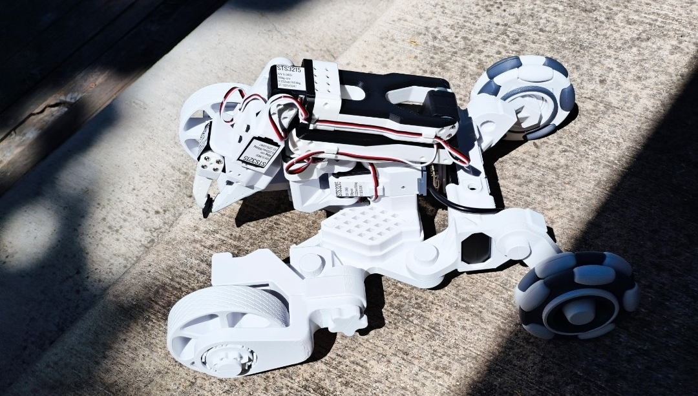

# SOBle - SO101 Platform over BLE



*Image and Design attributed to @BIO-SS*

The SO101 Platform is a simple chassis with two wheels for differential drive and a 6-axis IMU for heading, pitch and roll to help with several different autonomous algorithms. It also includes a connection and software pipeline for an optional apriltag detector/image stream from a gripper-mounted camera.

Included is a provided python package for host-side control and teleop of the SO101 platform over BLE, plus USB **leader** arm mapping. Under the [STL/](STL/) folder you will find several 3D models for printing as well as a list of sourced parts, in case you wish to build the platform yourself.

---

## Install

```bash
pip install "soble @ git+https://github.com/timrobot/SOBle.git@master"
```

---

## Quick usage

First, plug in the leader arm into your laptop. Make sure to record the port for your leader, as you will need it during connection.

```python
from soble import SO101Leader, SO101Platform

leader = SO101Leader("/dev/tty.usbmodem575E0032081")  # sub in the port of your leader here
leader.load_config("config.json")

platform = SO101Platform("Capybara")  # sub in the name of your robot/So101 Platform here

positions = leader.getArmPositions()  # 6 ints, 0..4095
platform.setArmPositions(positions)
platform.setLeftRightMotors(0, 0)

platform.stop()
leader.stop()
```

---

## Sourcing parts

The following table lists the electronics you will need to purchase in addition to the prints you will need to make in [STL/](STL/), which will require 1-2 rolls of 1KG of PLA. Note that ideally you will need to solder at least a little, but solderless [hooked jumper wires](https://www.amazon.com/dp/B0BJ627S1X) are available for those who prefer not to.


| Part name                                                 | Qty | Unit Cost | Buy Link                                                                                                 |
| --------------------------------------------------------- | --- | --------- | -------------------------------------------------------------------------------------------------------- |
| Feetech STS3215 continuous-rotation servo                 | 2   | $12       | [Alibaba](https://www.alibaba.com/product-detail/Top-Seller-Low-Cost-Feetech-STS3215_1600999461525.html)                  |
| 7.4 V 2S LiPo battery (5200 mAh)                          | 1   | $36       | [Amazon](https://www.amazon.com/Zeee-Battery-5200mAh-Vehicles-Airplane/dp/B092CZGW2P)                    |
| Mini LiPo balance charger/discharger                      | 1   | $39       | [Amazon](https://www.amazon.com/B6-Battery-Charger-Discharger-Connectors/dp/B0F2H3XR6S)                  |
| Waveshare ESP32-S3-LCD-1.3                                | 1   | $13       | [Waveshare](https://www.waveshare.com/esp32-s3-lcd-1.3.htm) (Standard version)                                                  |
| Barrel Connector (5.5x2.1) Male                           | 1   | $4        | [Amazon](https://www.amazon.com/Connector-Male-Female-Connectors-Security/dp/B0DVL9NDD1)                 |
| UBEC 5V 3A                                                | 1   | $8        | [Amazon](https://www.amazon.com/jussming-Adjustable-UBEC-Regulator-Controllers/dp/B0GRGGM2T4)            |
| USB-C female to 2-screw terminal                          | 1   | $8        | [Amazon](https://www.amazon.com/cablecc-Repair-Solderless-Connector-Terminal/dp/B0FY2HXYVF)              |
| XT60 male to 2-screw terminal                             | 1   | $7        | [Amazon](https://www.amazon.com/YANBORONSN-Connectors-Terminal-Solderless-Aircraft/dp/B0FNJWYFT2)        |
| Female to female jumper wires                             | 1   | $7        | [Amazon](https://www.amazon.com/EDGELEC-Breadboard-1pin-1pin-Connector-Multicolored/dp/B07GD312VG)       |
| M2 x 6mm Socket Head Screws                               | 1   | $4        | [Amazon](https://www.amazon.com/Opfiue-100PCS-Socket-Screws-Stainless/dp/B0FVDZ7SZD)                     |
| USB-C to MicroUSB (2pcs) (optional)                       | 1   | $5        | [Amazon](https://www.amazon.com/JXMOX-Charger-Support-Compatible-Android/dp/B0D479B8DC)                  |
| Raspberry Pi Zero 2 W (optional)                          | 1   | $41       | [Amazon](https://www.amazon.com/CanaKit-Raspberry-Zero-Basic-Official/dp/B0CT1Y3CQJ)                     |
| Arducam Pi Camera Module 3 (IMX708, autofocus) (optional) | 1   | $34       | [Amazon](https://www.amazon.com/Arducam-Raspberry-Camera-Autofocus-15-22pin/dp/B0C9PYCV9S)               |


Required electronics cost **$150**, primarily due to the battery and charger. Optional electronics add an additional **$80** (USB cable, Pi Zero 2 W, camera), for a grand total of **$230** plus filament.

The **SO101 follower arm** (Feetech servos and its own controller) is not included in the table above and must be purchased separately.

If you still need arm servos, order the two drive **STS3215** units from the table at the same time as the arm servos to save on shipping.

Once you have printed all your parts and acquired the electronics, follow the instructions in [assembly/](assembly/).

---

## Examples

There are a couple of examples to help you get started on your laptop if you just want to see if everything is working.


| Script                           | What it does                                |
| -------------------------------- | ------------------------------------------- |
| [`examples/lead-follow.py`](examples/lead-follow.py)        | Leader → follower joint mirror; wheels at 0 |
| [`examples/viz-apriltags.py`](examples/viz-apriltags.py)      | WASD drive, leader mirror, tag overlay      |
| [`examples/open-camera-stream.py`](examples/open-camera-stream.py) | WiFi setup + RTP camera preview (`cv2`)     |


AprilTag overlays need the robot’s Pi camera running tag detection and forwarding over BLE (separate Pi setup on the robot).

---

## Code reference — Class `SO101Leader`

```python
from soble import SO101Leader

leader = SO101Leader("/dev/tty.usbmodem575E0032081") # Mac
leader = SO101Leader("/dev/ttyACM0") # Linux
leader = SO101Leader("COM3") # Windows
leader.load_config("config.json")  # or pass config_path= in the constructor

```


| Method                                                                                           | Returns                                       | Notes                                                                                                                                                                    |
| ------------------------------------------------------------------------------------------------ | --------------------------------------------- | ------------------------------------------------------------------------------------------------------------------------------------------------------------------------ |
| `SO101Leader.limits_from_config(cfg: dict)`                                                      | `tuple[list[JointLimits], list[JointLimits]]` | **SOBle:** `"leader"` / `"follower"` with **J1…J6** `[min, max]`. **Standard SO101:** `"so101_leader"` / `"so101_follower"` with `"joints"` → `min_limit` / `max_limit`. |
| `SO101Leader(port, leader_limits=None, follower_limits=None, *, config_path=None, baud=1000000)` | —                                             | `**port` required**. Pass limits, `config_path`, or call `load_config()` before use.                                                                                     |
| `load_config(path)`                                                                              | `None`                                        | Load limits from JSON in either format above; (re)starts serial reader.                                                                                                  |
| `start()` / `stop()`                                                                             | `None`                                        | `start()` optional after `stop()`; `stop()` ends SYNC_READ loop.                                                                                                         |
| `getArmPositions()`                                                                              | `list[int]`                                   | **6** follower-mapped joint raws **0 … 4095**, or `**[]`** if not ready.                                                                                                 |
| `setArmPositions(joints)`                                                                        | `None`                                        | Engage leader torque, or pass `**[]`** to release (backdrivable; default).                                                                                               |

`load_config` accepts either:

- **Standard SO101** — `"so101_leader"` / `"so101_follower"`, each with a `"joints"` object (`min_limit` / `max_limit` per joint, keyed by name and sorted by motor `id`)
- **minified** — `"leader"` / `"follower"` with **J1…J6** as `[min, max]` pairs (see `examples/min_config.json`)

## Code reference — Class `SO101Platform`

```python
from soble import SO101Platform

platform = SO101Platform("Capybara") # or whatever the name appears on the LCD

```


| Method                                                                       | Returns           | Notes                                             |
| ---------------------------------------------------------------------------- | ----------------- | ------------------------------------------------- |
| `SO101Platform(device_name: str, *, reconnect_delay_s=0.25, log_state=True)` | —                 | Starts BLE connection automatically.              |
| `start()`                                                                    | `None`            | *Optional.* Restart communication after `stop()`. |
| `stop()`                                                                     | `None`            | Stop communication; clear tag state.              |
| `running` (property)                                                         | `bool`            | `True` if alive, else `False`                     |
| `last_notify_age_s()`                                                        | `float` or `None` | Seconds since a data packet has arrived.          |


### Core Commands


| Method                            | Returns                             | Notes                                                                                        |
| --------------------------------- | ----------------------------------- | -------------------------------------------------------------------------------------------- |
| `getArmPositions()`               | `list[int]`                         | **6** raw encoder values **J1 … J6** from follower arm; `**[]`** if no state yet.            |
| `getEncoders()`                   | `tuple[int, int]`                   | `(left, right)`, each **0 … 4095**.                                                          |
| `getIMUQuaternion()`              | `tuple[float, float, float, float]` | Unit quaternion **(w, x, y, z)**.                                                            |
| `getIMURPH()`                     | `tuple[float, float, float]`        | Roll, pitch, heading in **degrees**                                                              |
| `setLeftRightMotors(left, right)` | —                                   | Each **−125 … 125** (clamped).                                                               |
| `setArmPositions(joints)`         | —                                   | **6** values, each **0 … 4095** (12-bit). Order **J1 … J6**. Pass `**[]`** to disengage arm. |


### Camera Commands


| Method                                                             | Returns                                       | Notes                                                                                                           |
| ------------------------------------------------------------------ | --------------------------------------------- | --------------------------------------------------------------------------------------------------------------- |
| `getRaspiAlive()`                                                  | `bool`                                        | Pi serial seen recently.                                                                                        |
| `getApriltagTags()`                                                | `list[tuple[int, list[tuple[float, float]]]]` | Tag id plus four corner `(x, y)` pairs (**lb, rb, rt, lt**). Returns `[]` if no state yet or no tags in view.   |
| `setTagDetectionMode(family)`                                      | —                                             | `'tag16h5'`, `'tag25h9'`, or `'tag36h11'`.                                                                      |
| `getWifiConnected()`                                               | `bool`                                        | Pi WiFi up (`True` if online).                                                                                  |
| `enableCameraStreamMode(onFrameCallback, *, host=None, port=5000)` | `str` (host IP)                               | Pi streams camera over WiFi to this PC → BGR via `onFrameCallback`.                                             |
| `connectToWifi(ssid, password)`                                    | —                                             | *Experimental — do not use for now.* Connects Pi to a WiFi network. Poll `getWifiConnected()` before streaming. |


**Pi camera stream** — configure WiFi on the Pi first (`connectToWifi` is experimental). Each decoded frame is **1280×720** BGR on a background thread:

```python
import time
import cv2
from soble import SO101Platform

platform = SO101Platform("Capybara", log_state=False)  # BLE name on robot OLED
running = True

def on_frame(frame):
    global running
    cv2.imshow("SO101 camera", frame)
    if cv2.waitKey(1) & 0xFF in (ord("q"), 27): # press Q or Esc to quit
        running = False

try:
    # Start the camera stream
    while not platform.getWifiConnected():
        time.sleep(0.1)
    host = platform.enableCameraStreamMode(on_frame)

    # Do any other commands
    while running:
        platform.setArmPositions([2000, 2000, 1500, 2000, 2000, 2100])
        platform.setLeftRightMotors(125, 125) # full-forward
        time.sleep(0.04) # to prevent overload on the comms
finally:
    cv2.destroyAllWindows()
    platform.stop()
```

Full script: `examples/open-camera-stream.py`.

#### AprilTags — corners and image


| Item         | Value                                                                               |
| ------------ | ----------------------------------------------------------------------------------- |
| Image size   | **1280 × 720** pixels                                                               |
| Tag family   | **tag16h5** by default; use `setTagDetectionMode()` for **tag25h9** or **tag36h11** |
| Corner order | **lb, rb, rt, lt** — each corner `(x, y)` float pixels                              |
| `x` range    | **0 … 1280**                                                                        |
| `y` range    | **0 … 720**                                                                         |
| Max tags     | **10**                                                                              |


**Example** — two tag16h5 tags in view:

```python
>>> platform.getApriltagTags()
[
    (0, [
        (612.4, 388.2),   # lb
        (667.8, 388.2),   # rb
        (667.8, 331.6),   # rt
        (612.4, 331.6),   # lt
    ]),
    (3, [
        (118.4, 142.3),
        (182.0, 140.0),
        (180.2, 198.1),
        (120.0, 200.5),
    ]),
]
```

Each list entry is `(tag_id, corners_px)` with **four** `(x, y)` pixel pairs in **lb → rb → rt → lt** order.

Reconnects if no state notify for **0.3 s** after the first good packet.