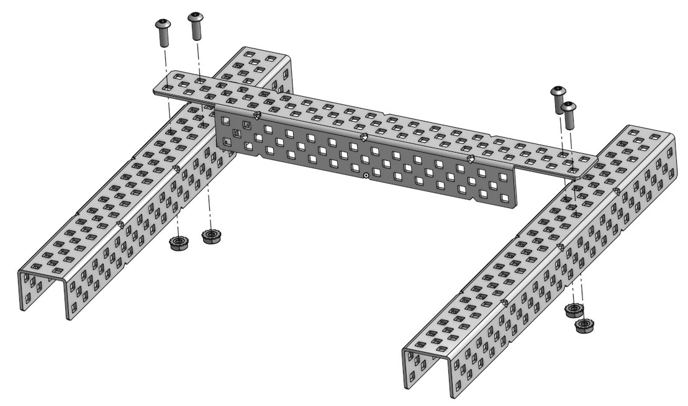
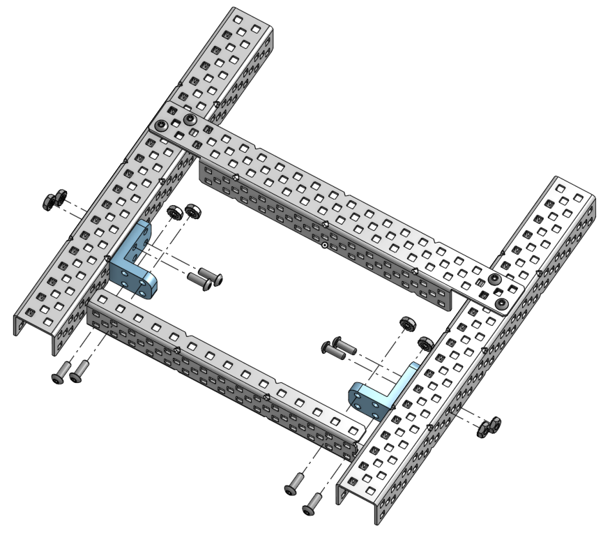
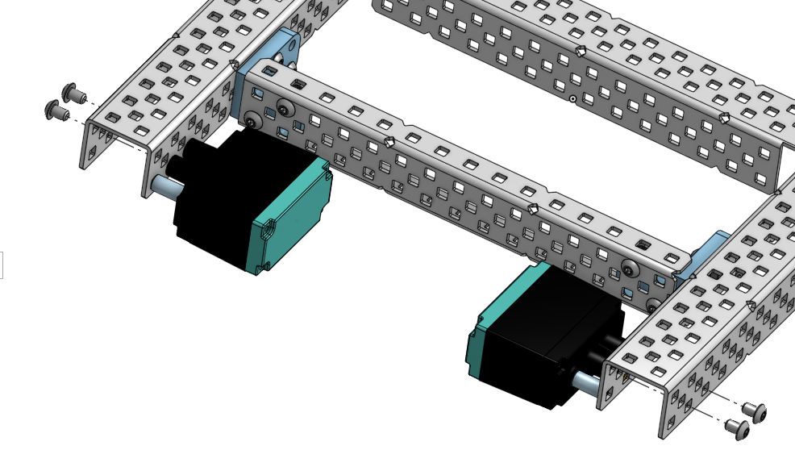
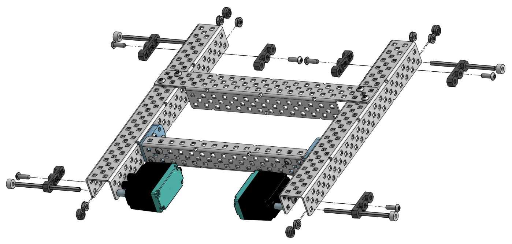
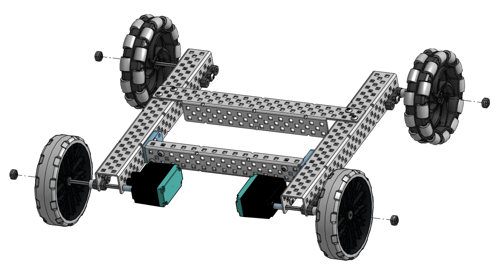
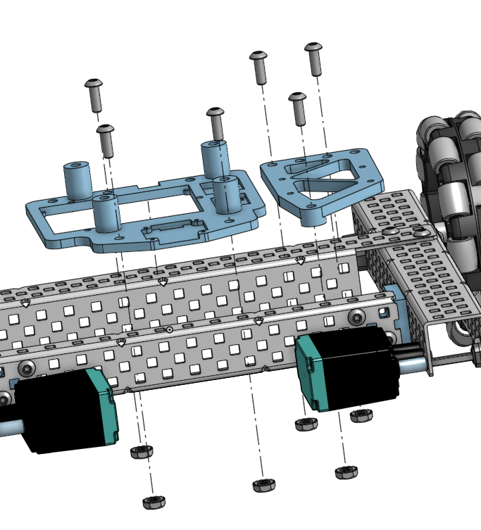
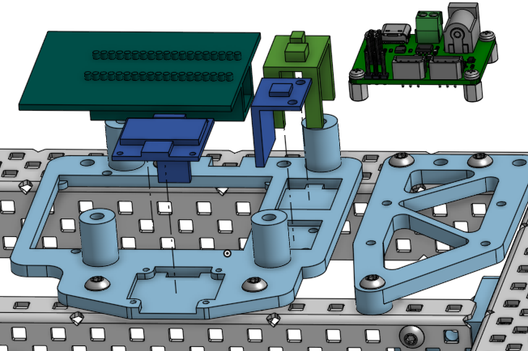

# SO101 platform — assembly guide

Step-by-step build for the VEX-based SO101 mobile platform. Print the 3D parts from this repo first, then follow the steps below. Structural hardware matches the [sourcing table](../README.md#structural-parts-v1) in the main README.

Each step has an illustration (`StepN.png`) and a parts table. Fasteners are **#8-32** star-drive unless noted.

---

## Before you start

- Lay out all printed parts and label bags for each step.
- Use a **#8-32** driver and keep keps nuts accessible.
- Motor mount screws are **#6-32** (smaller than the frame screws).

---

## Step 1 — Rear cross member



Join the two side rails with the **L-channel** at the **rear** of the chassis (one end of the U-channels).

| Part | Qty | Notes |
|------|-----|--------|
| U-channel | 2 | Long side rails |
| L-channel | 1 | Rear cross member |
| #8-32 × 0.5" screw | 4 | |
| #8-32 keps nut | 4 | |

**Assembly**

1. Place the two U-channels parallel, holes facing inward.
2. Lay the L-channel across the **top/rear** ends of both U-channels.
3. At each corner, pass a screw through the L-channel and U-channel (two holes per side).
4. Thread a keps nut on each screw and tighten.

---

## Step 2 — Mid frame cross member (C-channel + L-brackets)



Add the **C-channel** cross member partway along the frame, using **L-brackets** at both sides.

| Part | Qty | Notes |
|------|-----|--------|
| C-channel | 1 | Mid cross member |
| L-bracket (printed) | 2 | |
| #8-32 × 0.5" screw | 8 | |
| #8-32 keps nut | 8 | |

**Assembly**

1. Position the C-channel between the U-channels at the height shown in the diagram.
2. For **each** L-bracket (left and right):
   - Use **four** screw/nut pairs: two through the bracket into the **U-channel**, two through the bracket into the **C-channel**.
3. Mirror the bracket on the opposite side.

---

## Step 3 — Drive motors



Mount both drive motors on the **inside** of the U-channels (front of the robot in the final orientation).

| Part | Qty | Notes |
|------|-----|--------|
| 2-wire Motor 393 | 2 | VEX drive motors |
| Motor Controller 29 | 2 | One per motor |
| #6-32 screw (motor mount) | 4 | Small motor screws |

**Assembly**

1. Pair each Motor 393 with a Motor Controller 29 per VEX instructions.
2. Hold a motor against the inside face of a U-channel, shaft pointing toward the wheel end.
3. Drive two **#6-32** screws through the channel into the motor mount holes.
4. Repeat for the opposite side.

---

## Step 4 — Axles, bearings, and shaft hardware



Install the **wheel axles** and **bearing flats** on both U-channels (four wheel stations).

| Part | Qty | Notes |
|------|-----|--------|
| 3" axle (shaft) | 4 | From shaft add-on kit |
| Bearing flat | 6 | |
| 0.375" nylon spacer | 4 | From spacer variety pack |
| Rubber shaft collar | 4 | |
| #8-32 × 0.5" screw | 6 | |
| #8-32 keps nut | 6 | |

**Assembly**

1. At each wheel location, bolt **bearing flats** to the U-channel with **0.5"** screws and nuts (see diagram for hole pattern).
2. Slide each **3" axle** through the bearing stack on one side of the chassis.
3. Add **spacers** on the axle where shown so the wheel will sit at the correct track width.
4. Leave **shaft collars** off for now — they go on in Step 5 after the wheels.

---

## Step 5 — Wheels



Press the wheels onto the axles and lock them with shaft collars.

| Part | Qty | Notes |
|------|-----|--------|
| 4" anti-static wheel | 2 | Front (traction) |
| 4" omni-directional wheel | 2 | Rear |
| Rubber shaft collar | 4 | Same as Step 4; install here |

**Assembly**

1. **Front:** mount one **traction** wheel on each front axle.
2. **Rear:** mount one **omni** wheel on each rear axle.
3. Slide a **shaft collar** onto the outside of each axle and tighten against the wheel so it cannot slide off.

---

## Step 6 — Electronics mounting plates



Bolt the two **printed mounting plates** to the top of the C-channel.

| Part | Qty | Notes |
|------|-----|--------|
| Electronics mount plate (large) | 1 | 3D printed |
| Electronics mount plate (small) | 1 | 3D printed |
| #8-32 × 0.5" screw | 6 | |
| #8-32 keps nut | 6 | |

**Assembly**

1. Place the **large** plate over the left/center section of the C-channel; align the screw holes with the channel grid.
2. Place the **small** plate on the right section.
3. Pass screws down through each plate hole and through the C-channel; tighten keps nuts underneath.

---

## Step 7 — Main electronics on the plates



Mount the control boards and sensors onto the plates from Step 6. The **SO101 driver board** (right side) is already on standoffs — leave it assembled as shown.

| Part | Qty | Notes |
|------|-----|--------|
| ESP32-WROOM-32 dev board | 1 | Large board, center of large plate (direct mount, not standoffs) |
| SO101 driver board | 1 | Right side; standoffs pre-installed |
| 5V UBEC (3A) | 1 | Green module in diagram; steps battery voltage down to 5 V |
| GY-521 (MPU-6050) | 1 | IMU |
| SSD1306 OLED (128×64) | 1 | Status display |
| M2.5 PCB screw | As needed | Included with the SO101 arm kit |

**Assembly**

1. Mount the **ESP32** dev board to the **center** of the large electronics plate (screw into the plate bosses — no standoffs).
2. Confirm the **SO101 driver board** on the right is seated on its standoffs and secured.
3. Mount the **5V UBEC** (green module) on the large plate as shown in the diagram.
4. Attach the **MPU-6050** and **OLED** using **M2.5** screws from the SO101 arm hardware as needed.

*Optional Pi + camera are a separate add-on; see the main README. Electrical wiring is covered in the firmware docs — finish mechanical mounting first.*

---

## Step 8 — SO101 arm base


Mount the **base of the SO101 follower arm** to the chassis (printed mount / tower in the diagram).

| Part | Qty | Notes |
|------|-----|--------|
| SO101 arm base | 1 | Mounts to the electronics stack |
| #8-32 × 1.75" screw | 4 | |
| #8-32 keps nut | 4 | |

**Assembly**

1. Position the **SO101 arm base** over the mounting holes on the electronics plate / frame as shown.
2. Pass four **1.75"** screws through the base and the aligned holes in the plate and structure below.
3. Tighten **keps nuts** on the underside of the stack.
4. Complete the rest of the arm in **Step 11** below (after wiring).

---

## Step 9 — Wiring the sensors


With the mechanics finished, wire the sensors and peripherals to the SO101 driver board as shown in the diagram.

1. **Drive motors**
   - Connect the **left drive motor** to the **PWM1** motor output.
   - Connect the **right drive motor** to the **PWM4** motor output.
2. **Right encoder (6-pin)**
   - Plug the **right encoder** into the **5-pin PWM5** header.
   - Orient the connector so the **red wire is closest to the motors**.
3. **Left encoder (4-pin)**
   - Plug the **left encoder** into the **4-pin VS1** header.
   - Orient the connector so the **red wire is farthest away from the motors**.
4. **IMU (GY-521 / MPU-6050)**
   - Wire the IMU to the matching header pins exactly as in the diagram:
     - **RED → 3V3**
     - **BLUE → GND**
     - **YELLOW → SDA**
     - **GREEN → SCL**
5. **SO101 arm serial (PWM6 header)**
   - Connect the arm cable to the **PWM6** header:
     - **BLUE → GND**
     - **WHITE → RX**
     - **PURPLE → TX**
6. **OLED display (SSD1306)**
   - This is the trickiest wiring; double-check each color:
     - **3V3** on the OLED → **RED** on **PWM6**
     - **GND** on the OLED → **BLUE** on **TH3**
     - **SDA** on the OLED → **YELLOW** on **TH3**
     - **SCL** on the OLED → **GREEN** on **TH2**

---

## Step 10 — Wiring the power


Wire the power path (battery → buck converter → SO101 board) as shown.

1. Plug the **XT30 connectors** into the **two XT30 sockets** on the PCB.
2. Plug the **jumper wires** into the **DC/DC buck**:
   - **Orange/Red → Vin**
   - **Blue/Black → GND**
3. Plug the **barrel connector** into the **SO101 board**.

---

## Step 11 — Assemble the SO101 arm

Build the follower arm per the official [LeRobot SO-101 assembly guide](https://huggingface.co/docs/lerobot/so101) (motor setup, joints, gripper). When the arm is complete, mount it on the platform base from Step 8.

---

## Step 12 — Flash firmware

Open [`esp32/So101-Platform/`](../esp32/So101-Platform/) in the Arduino IDE (or your usual ESP32 flow) and flash the sketch to the dev board.

---

## Step 13 — Install the battery and choose power mode

1. **Install the battery** — Seat the pack and confirm motor/arm power through the buck path (Step 10) before driving anything.

2. **Choose how you power the ESP32** (and Pi, if used):

   **Option A — Direct power (no Raspi cam)**  
   Use any portable **5V power bank** and connect it to the **ESP32 USB-C** port.

   **Option B — Raspi cam + USB power**  
   Complete **[Optional Raspi Camera Attachment](#optional-raspi-camera-attachment-option-b)** below before Step 14.

---

## Step 14 — PC: install `soble` and run examples

On your computer, install the Python package from the [main README](../README.md), pair over BLE, then try:

- [`examples/lead-follow.py`](../examples/lead-follow.py) — leader arm mirrors to the follower
- [`examples/viz_apriltags.py`](../examples/viz_apriltags.py) — teleop + tag overlay (requires Pi camera path)

---

## Optional Raspi Camera Attachment (Option B)

**Option B only.** Complete these substeps after Steps 1–13 (and Step 12 firmware). Finish this section **before** Step 14 on your PC.

1. **Mount the camera bracket** — Attach the printed **Raspi cam mount** to the SO101 **gripper** with the available **M3 screws and nuts**.
2. **Camera to Pi** — Connect the **Raspberry Pi Camera Module v1.3** to the **Raspberry Pi Zero 2 W** camera port.
3. **Mount Pi + camera** — Secure the **camera** and **Pi Zero 2 W** to the cam mount.
4. **SD card** — Flash an SD card with **Raspberry Pi OS** (Raspbian).
5. **AprilTag service** — Boot the Pi, copy the `SOBle/raspi` tree onto it, and run:
   ```bash
   bash install-detect-atags-service.sh
   ```
   (from [`SOBle/raspi/`](../raspi/)). Then **shut the Pi down**.
6. **Power from the DCDC board** — Using the **micro-USB to jumper** cable:
   - **GND** jumpers → **GND** pins on the **DCDC** board
   - **3V3** jumper → **VOUT** pins on the **DCDC** board
   - **Micro-USB** end → **power** input on the **Pi Zero 2 W**
7. **Data to ESP32** — Using the **micro-USB to USB-C** cable:
   - **Micro-USB** end → **USB data** on the **Pi**
   - **USB-C** end → **ESP32** dev board

You may now proceed to **Step 14** (`soble` + examples on your PC).

More Pi details: [raspi/README.md](../raspi/README.md).

---

## Quick reference — all steps

| Step | Summary | Image |
|------|---------|--------|
| 1 | U-channels + rear L-channel | [Step1.png](Step1.png) |
| 2 | C-channel + L-brackets | [Step2.png](Step2.png) |
| 3 | Motors + motor controllers | [Step3.png](Step3.png) |
| 4 | Axles, bearings, spacers | [Step4.png](Step4.png) |
| 5 | Wheels + shaft collars | [Step5.png](Step5.png) |
| 6 | Electronics plates | [Step6.png](Step6.png) |
| 7 | Boards and sensors | [Step7.png](Step7.png) |
| 8 | SO101 arm base | [Step8.png](Step8.png) |
| 9 | Wiring the sensors | [Wiring.png](Wiring.png) |
| 10 | Wiring the power | [DCDC.png](DCDC.png) |
| 11 | Assemble SO101 arm | — |
| 12 | Flash firmware | — |
| 13 | Battery + power mode | — |
| 14 | PC: `soble` + examples | — |
| — | *Option B:* Raspi camera attachment | [below Step 14](#optional-raspi-camera-attachment-option-b) |

If a printed part name in your slicer folder differs from the labels above, match by shape to the step image.
