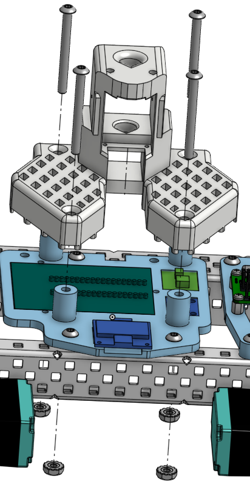
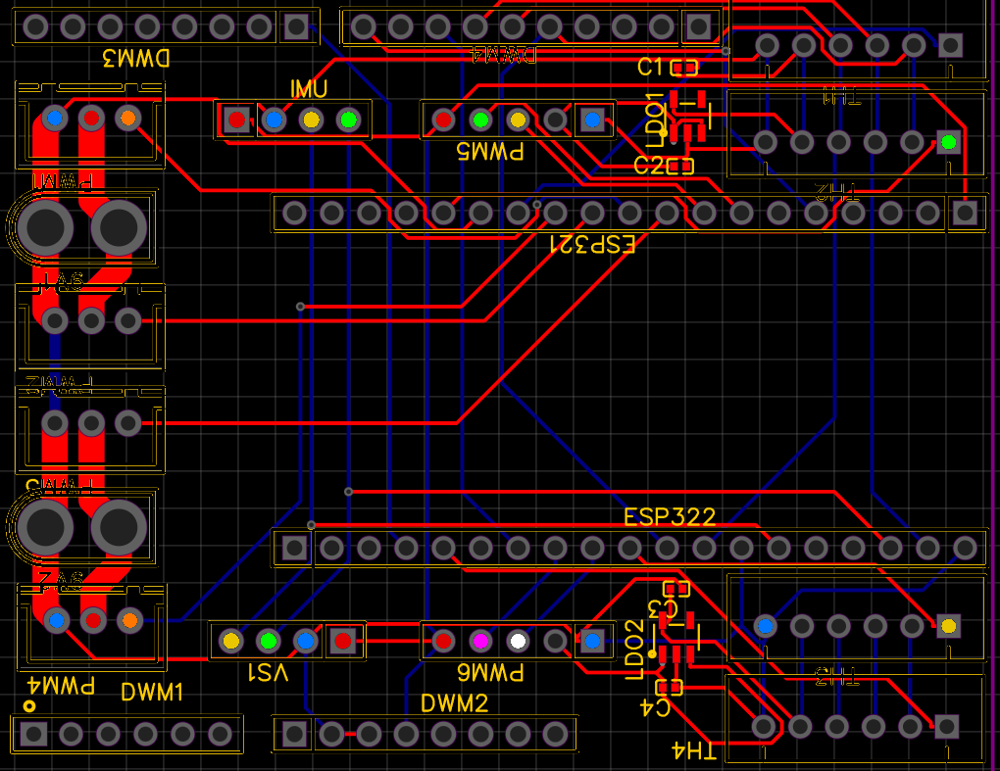
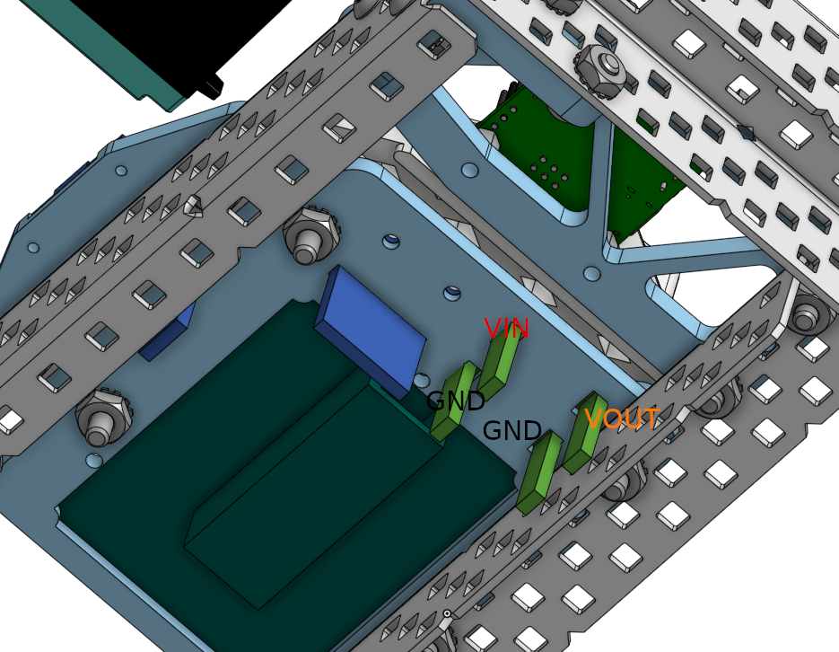

# Assembly guide

Purchase the electronics in the [sourcing table](../README.md#sourcing-parts), then print the 3D parts from [STL/](../STL/) and follow the steps below.

Each step has an illustration where noted (see the [quick reference](#quick-reference--all-steps) table).

---

## Contents

- [Step 1 — Omni-directional ball bearing](#step-1--omni-directional-ball-bearing)
- [Step 2 — Omni-directional rollers](#step-2--omni-directional-rollers)
- [Step 3 — Rear omni-wheel assembly](#step-3--rear-omni-wheel-assembly)
- [Step 4 — Traction wheel servo](#step-4--traction-wheel-servo)
- [Step 5 — Traction wheel bearing](#step-5--traction-wheel-bearing)
- [Step 6 — Front wheel assembly](#step-6--front-wheel-assembly)
- [Step 7 — Chassis assembly](#step-7--chassis-assembly)
- [Step 8 — Mounting the SO101 arm](#step-8--mounting-the-so101-arm)
- [Step 9 — Download SOBle and flash firmware](#step-9--download-soble-and-flash-firmware)
- [Step 10a — Preparing the cables and LCD pins](#step-10a--preparing-the-cables-and-lcd-pins)
- [Step 10b — Wiring the arm UART and power](#step-10b--wiring-the-arm-uart-and-power)
- [Step 11 — Powering up the robot](#step-11--powering-up-the-robot)
- [Raspi camera attachment *(optional)*](#raspi-camera-attachment-optional)
- [Quick reference — all steps](#quick-reference--all-steps)

---

## Step 1 — Omni-directional ball bearing


| Part | Qty | Notes |
| ---- | --- | ----- |
| Ball bearing | 6 | |
| Large pentagonal raceway | 1 | 3D printed |
| Small hex raceway | 1 | 3D printed |
| Ball crown | 1 | 3D printed |


**Assembly**

1. Insert all **six ball bearings** onto the **large pentagonal raceway**, then slide in the **small hex raceway**.

   

2. Push the **hex raceway** against the balls while turning it so that the **protruding circle faces up**. Align the balls so they are spaced evenly at **60°**.

   

3. Push the **ball crown** into the balls until it **snaps into place**.

   

---

## Step 2 — Omni-directional rollers

> **IN MAINTENANCE:** This section is currently being reconstructed in order to fix a mechanical issue that was encountered during testing. Please come back later.

---

## Step 3 — Rear omni-wheel assembly


| Part | Qty | Notes |
| ---- | --- | ----- |
| Rear center hub | 1 | 3D printed |
| Main bolt | 1 | |
| Rear wheel axle | 1 | 3D printed |
| Rear axle cap | 1 | 3D printed |
| Omni wheel | 1 | From Steps 1–2 |


**Assembly**

1. Connect the **rear wheel axle** to the **rear center hub** with the **main bolt**.

   

2. Slide the **omni wheel** onto the rear axle and tighten the **rear axle cap**.

   

3. Repeat **Steps 1–3** for the other side.

---

## Step 4 — Traction wheel servo

*Todo — parts table and assembly instructions.*

---

## Step 5 — Traction wheel bearing

*Todo — parts table and assembly instructions.*

---

## Step 6 — Front wheel assembly

*Todo — parts table and assembly instructions.*

---

## Step 7 — Chassis assembly

*Todo — parts table and assembly instructions.*

---

## Step 8 — Mounting the SO101 arm



Build the follower arm per the official [LeRobot SO-101 assembly guide](https://huggingface.co/docs/lerobot/so101) (motor setup, joints, gripper).

Mount the **base of the SO101 follower arm** to the chassis (printed mount / tower in the diagram) using the lock-pins.

*Todo — complete the mounting instructions.*

---

## Step 9 — Download SOBle and flash firmware

If the board is already on the robot, **do not power the robot**. The driver board may be damaged if the robot is powered without a shared ground.

1. **Get the repo** (needed for the Arduino sketch and examples):

   ```bash
   git clone https://github.com/timrobot/SOBle.git
   cd SOBle
   ```

2. **Install the Python package**:

   ```bash
   pip install "soble @ git+https://github.com/timrobot/SOBle.git@master"
   ```

3. Plug a **USB-C** cable from your computer to the LCD board.
4. **Flash firmware** — Open `esp32/So101-Platform/` in the Arduino IDE (or your usual ESP32 toolchain), select the **ESP32-S3** board and the correct serial port, and upload the sketch. It should take around one minute.
5. Unplug the USB-C cable from the LCD board.

---

## Step 10a — Preparing the cables and LCD pins

1. Insert the barrel connector and UBEC power wires into the XT60 female screw terminal, as shown in the diagram.
2. *Optional.* If you are planning to use the Raspi camera or you have *hooked jumpers*, you will have to do this. Be warned that this step is **irreversible**:
   1. Remove the header from the end of the UBEC.
   2. Insert the power wires into the USB-C female screw terminal, as shown in the diagram.
3. Solder the header pins onto the LCD board's right side. *(You may skip this step if you are using hooked jumpers.)*

---

## Step 10b — Wiring the arm UART and power



1. Attach the jumper headers (or hooks) to the LCB board's right side (diagram A), and then wire them to the driver board (diagram B).
2. LCD connection options:
   1. **With Raspi camera** — Use a USB-C → µ-USB cable from the UBEC to the Raspi PWR. Use a µ-USB → USB-C cable from Raspi USB to the LCD board. *(See [Raspi camera attachment *(optional)*](#raspi-camera-attachment-optional) for camera assembly.)*
   2. **No Raspi camera, UBEC USB-C** — Use a USB-C to USB-C cable from the UBEC to the LCD board.
   3. **No Raspi camera, UBEC header** — Plug the header into the right side of the LCD board (as shown).
3. Plug the barrel connector into the driver board.
4. Insert the 7.4 V battery into the battery cage and secure it with the spring-loaded panel.

---

## Step 11 — Powering up the robot



> **WARNING:** When you start the example below, the **follower arm on the robot** will immediately engage to match the joint mapping in your config file. Keep hands clear of the arm and make sure it has room to move before running.

1. Plug the leader arm into your PC or Mac. Record the serial port.
2. Plug the XT60 male connector into the battery's XT60 female socket. **This will power the robot.**
3. Read the robot name on the OLED. Then, on your PC or Mac:

   ```bash
   cd examples
   python viz-apriltags.py -p /dev/tty.usbmodem575E0032081 -n Capybara -c angular_config.json
   ```

   - `-p` — *Leader port* (Linux e.g. `/dev/ttyACM0`, Windows e.g. `COM3`, macOS e.g. `/dev/tty.usbmodem575E0032081`)
   - `-n` — *Robot name* (e.g. `Capybara`)
   - `-c` — *Config file* — leader/follower joint limits (see [angular_config.json](../examples/angular_config.json))

You can now control the robot using **WASD** and the leader arm.

---

## Raspi camera attachment *(optional)*

If you plan to add the **Raspi camera attachment**, print [`so101-pcb-camera-wrist-mount.stl`](../STL/Optional/so101-pcb-camera-wrist-mount.stl) and mount it on the gripper as shown:


1. **Camera to Pi** — Connect the **Arducam IMX708** camera module to the **Raspberry Pi Zero 2 W** camera port.
2. **Mount Pi + camera** — Secure the camera and Pi Zero 2 W to the cam mount.
3. **SD card** — Flash an SD card with **Raspberry Pi OS**.
4. **AprilTag service** — Boot the Pi, copy the `SOBle/raspi` tree onto it, and run:

   ```bash
   bash install-detect-atags-service.sh
   ```

   (from [`SOBle/raspi/`](../raspi/)). Then **shut the Pi down**.

More Pi details: [raspi/README.md](../raspi/README.md).

*Optional:* Display an AprilTag such as [this tag16h5 example](https://berndpfrommer.github.io/tagslam_web/media/tag_16h5.png) on your phone — with the Raspi camera attached, you should see the tag detected in the pygame window.

---

## Quick reference — all steps

| Step | Summary | Image |
| ---- | ------- | ----- |
| 1 | Omni-directional ball bearing | [1a.png](1a.png) · [1b.png](1b.png) · [1c.png](1c.png) |
| 2 | Omni-directional rollers | — |
| 3 | Rear omni-wheel assembly | [3a.png](3a.png) · [3b.png](3b.png) |
| 4 | Traction wheel servo | — |
| 5 | Traction wheel bearing | — |
| 6 | Front wheel assembly | — |
| 7 | Chassis assembly | — |
| 8 | Mount SO101 follower arm | [Step8.png](Step8.png) |
| 9 | Clone SOBle, pip install, flash ESP32-S3 firmware | — |
| 10a | Prepare cables and LCD header pins | — |
| 10b | Wire arm UART, UBEC, and LCD power | [Wiring.png](Wiring.png) |
| 11 | Power on, run `viz-apriltags.py` | [DCDC.png](DCDC.png) |
| — | *Optional:* Raspi camera + AprilTag service | [CamMount.png](CamMount.png) |

If a printed part name in your slicer folder differs from the labels above, match by shape to the step image.
